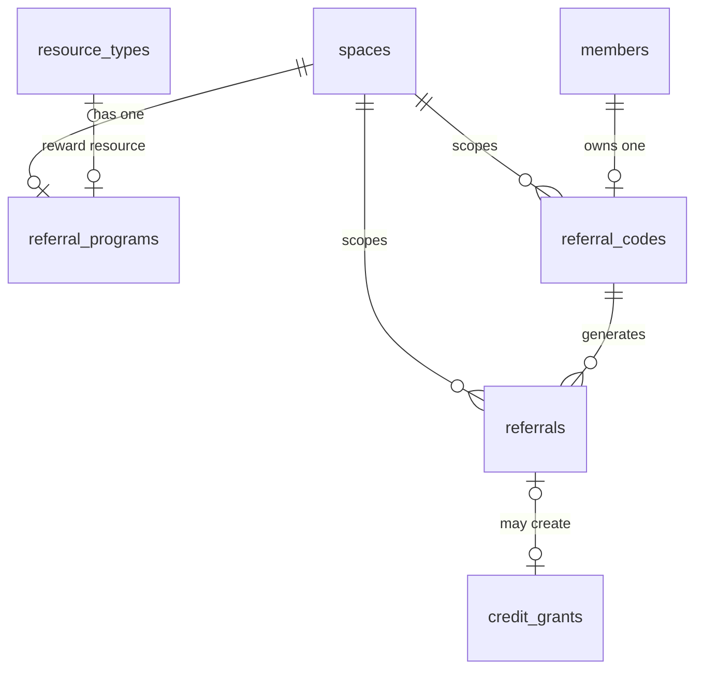
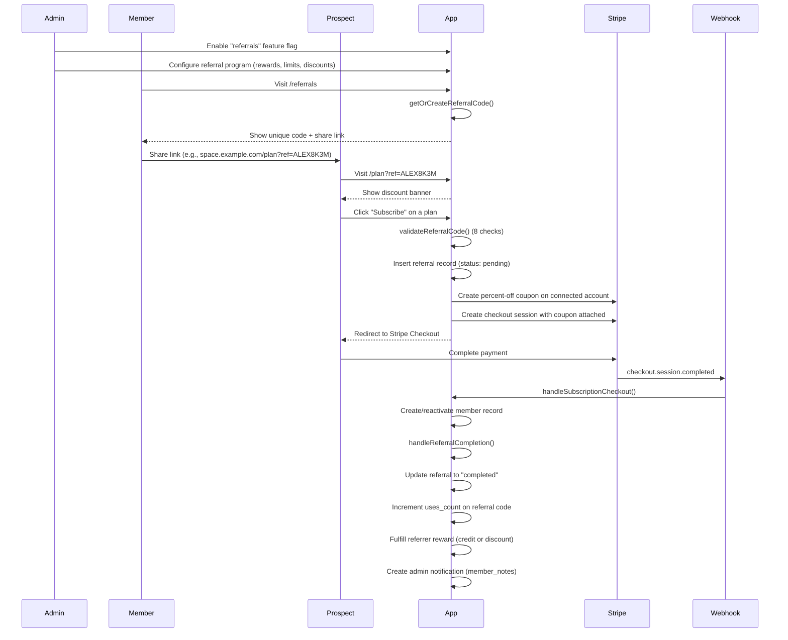

# Referral System

Member-to-member referral program for coworking spaces. Each space can configure a referral program that rewards existing members for bringing in new subscribers, while giving the referred person a discount on their first subscription.

---

## Overview

### Design Decisions

- **Per-member codes**: Every active member gets exactly one unique referral code per space. Codes are 8-character uppercase alphanumeric strings (ambiguous characters `I`, `O`, `0`, `1` are excluded).
- **One program per space**: Each space has at most one active referral program, configured by space admins. The `referral_programs` table enforces this with a `UNIQUE(space_id)` constraint.
- **Stripe coupon-based discounts**: Referred-member discounts are implemented as Stripe percent-off coupons created on the tenant's connected account. Referrer discount rewards also use Stripe coupons applied directly to the referrer's existing subscription.
- **Feature-flag gated**: The entire referral system is behind the `referrals` feature flag on `spaces.feature_flags`. Both the member-facing UI and the admin configuration require this flag to be enabled.
- **New members only**: Referral codes can only be used by people who have never held a membership (any status) at the target space. This prevents abuse from churned members re-subscribing with a discount.

---

## Database Schema

Three tables were added across three migrations. All tables have RLS enabled, `updated_at` triggers, and rollback comments.

### referral_programs

Configuration table. One row per space (enforced by `UNIQUE(space_id)`).

| Column | Type | Description |
|--------|------|-------------|
| `id` | `uuid` PK | Auto-generated |
| `space_id` | `uuid` FK -> `spaces` | The space this program belongs to |
| `active` | `boolean` | Whether the program is currently accepting referrals |
| `referrer_reward_type` | `text` | One of `credit`, `discount`, `none` |
| `referrer_credit_minutes` | `integer` | Minutes of credit to grant the referrer (when reward type is `credit`) |
| `referrer_credit_resource_type_id` | `uuid` FK -> `resource_types` | Which resource type the credit applies to |
| `referrer_discount_percent` | `integer` | Percent off for the referrer's subscription (when reward type is `discount`, 1-100) |
| `referrer_discount_months` | `integer` | How many months the referrer discount lasts (1-12, default 1) |
| `referred_discount_percent` | `integer` | Percent off for the new member's checkout (0-100, default 0) |
| `referred_discount_months` | `integer` | How many months the referred discount lasts (1-12, default 1) |
| `max_referrals_per_member` | `integer` | Max completed referrals per member (null = unlimited) |
| `max_referrals_total` | `integer` | Max completed referrals across the whole space (null = unlimited) |
| `code_expiry_days` | `integer` | Days until a generated code expires (null = never, default 90) |

**RLS policies**: Members can read their own space's program. Space admins can manage. Platform admins have full access.

### referral_codes

Per-member codes. One code per member per space (enforced by `UNIQUE(space_id, member_id)`). Code uniqueness within a space is enforced by `UNIQUE(space_id, code)`.

| Column | Type | Description |
|--------|------|-------------|
| `id` | `uuid` PK | Auto-generated |
| `space_id` | `uuid` FK -> `spaces` | Space scope |
| `member_id` | `uuid` FK -> `members` | The member who owns this code |
| `user_id` | `uuid` FK -> `auth.users` | The user behind the member (for quick profile lookups) |
| `code` | `text` | 8-character alphanumeric code (e.g., `ALEX8K3M`) |
| `active` | `boolean` | Whether the code can still be used |
| `uses_count` | `integer` | Number of completed referrals via this code |
| `expires_at` | `timestamptz` | When the code expires (null = never) |

**RLS policies**: Members can read their own code. Space admins can manage all codes. Platform admins have full access.

### referrals

Tracks individual referral events from creation (pending) through completion or cancellation.

| Column | Type | Description |
|--------|------|-------------|
| `id` | `uuid` PK | Auto-generated |
| `space_id` | `uuid` FK -> `spaces` | Space scope |
| `referral_code_id` | `uuid` FK -> `referral_codes` | The code that was used |
| `referrer_member_id` | `uuid` FK -> `members` | The referring member |
| `referrer_user_id` | `uuid` FK -> `auth.users` | The referring user |
| `referred_user_id` | `uuid` FK -> `auth.users` | The referred person (set on checkout completion) |
| `referred_member_id` | `uuid` FK -> `members` | The referred member record (set on checkout completion) |
| `referred_email` | `text` | The referred person's email |
| `status` | `text` | One of `pending`, `completed`, `expired`, `cancelled` |
| `stripe_coupon_id` | `text` | Stripe coupon ID for the referred member's discount |
| `referrer_stripe_coupon_id` | `text` | Stripe coupon ID for the referrer's discount reward |
| `referrer_rewarded` | `boolean` | Whether the referrer has been rewarded |
| `referrer_reward_type` | `text` | What reward was given (`credit`, `discount`, `none`) |
| `referrer_credit_grant_id` | `uuid` FK -> `credit_grants` | Link to the credit grant (if reward was credits) |
| `completed_at` | `timestamptz` | When the referred member completed checkout |

**RLS policies**: Referrers can read their own referrals. Referred users can read their own referral record. Space admins can manage. Platform admins have full access.

**Partial unique index**: `UNIQUE(space_id, referred_email) WHERE status IN ('pending', 'completed')` prevents the same email from being referred twice.

### Enum Extension

The `credit_grant_source` enum is extended with a `referral` value to support credit rewards:

```sql
ALTER TYPE credit_grant_source ADD VALUE IF NOT EXISTS 'referral';
```

### Entity Relationships



---

## How It Works

### End-to-End Flow



### Step-by-Step Breakdown

#### 1. Admin enables the referral program

1. Toggle the `referrals` feature flag in the space settings to `true`.
2. Navigate to the admin referrals page and configure the program using `upsertReferralProgram`. This upserts a single row into `referral_programs` for the space.

#### 2. Member gets their referral code

When a member visits `/referrals`, the `getReferralData` server action:

1. Checks the `referrals` feature flag on the space.
2. Verifies the referral program is active.
3. Confirms the user is an active member.
4. Calls `getOrCreateReferralCode()` which either returns the existing code or generates a new one (idempotent, retries up to 3 times on code collision).
5. Returns the code, expiry date, program details, and the member's referral history.

#### 3. Referred person visits the plan page

The prospect lands on `/plan?ref=CODE`. The UI displays a discount banner showing the referrer's name and the discount percentage/duration.

#### 4. Checkout flow

When the prospect clicks subscribe, `subscribeToPlan` in `apps/web/app/(app)/plan/actions.ts`:

1. Validates the referral code via `validateReferralCode()` (see Anti-Abuse Measures below).
2. Creates a **pending** referral record in the `referrals` table.
3. Creates a Stripe percent-off coupon on the tenant's connected account via `createReferralCoupon()`.
4. Stores the coupon ID on the referral record.
5. Passes the `couponId` and `referralId` to `createCheckoutSession()`, which attaches the coupon to the Stripe Checkout Session and stores the `referral_id` in the session's metadata.

#### 5. Webhook completes the referral

When Stripe fires `checkout.session.completed`, the webhook handler in `handleSubscriptionCheckout`:

1. Creates or reactivates the member record.
2. Reads `referral_id` from the session metadata.
3. Calls `handleReferralCompletion()` which:
   - Loads the referral and checks idempotency (skips if already completed or rewarded).
   - Updates the referral status to `completed` and sets `completed_at`, `referred_user_id`, and `referred_member_id`.
   - Increments `uses_count` on the referral code.
   - Fulfills the referrer reward based on `referrer_reward_type`:
     - **credit**: Calls `grant_credits` RPC with source `referral` and stores the `credit_grant_id` on the referral.
     - **discount**: Creates a new Stripe coupon and applies it to the referrer's existing subscription via `applyReferrerDiscountCoupon`.
     - **none**: No reward.
   - Marks `referrer_rewarded = true` on the referral.
   - Creates an admin notification as a `member_notes` entry on the referrer's member record (category: `billing`).

---

## Configuration

### Referral Program Settings

All settings are managed through the admin referrals page. The Zod schema (`referralProgramSchema`) validates all input.

| Setting | Type | Constraints | Description |
|---------|------|-------------|-------------|
| `active` | boolean | required | Enable/disable the program |
| `referrerRewardType` | enum | `credit`, `discount`, `none` | What the referrer gets when a referral completes |
| `referrerCreditMinutes` | integer | positive, nullable | Minutes of credit to grant (only used when reward type is `credit`) |
| `referrerCreditResourceTypeId` | uuid | nullable | Which resource type the credit applies to |
| `referrerDiscountPercent` | integer | 1-100, nullable | Percent off referrer's subscription (only used when reward type is `discount`) |
| `referrerDiscountMonths` | integer | 1-12, nullable | Duration of referrer discount |
| `referredDiscountPercent` | integer | 0-100 | Percent off for the new member at checkout |
| `referredDiscountMonths` | integer | 1-12 | Duration of the new member discount |
| `maxReferralsPerMember` | integer | positive, nullable | Cap per member (null = unlimited) |
| `maxReferralsTotal` | integer | positive, nullable | Cap per space (null = unlimited) |
| `codeExpiryDays` | integer | positive, nullable | Days until codes expire (null = never) |

### Example Configurations

**Simple credit reward** -- give the referrer 120 minutes of meeting room credit, and the new member 20% off for 3 months:

```
referrerRewardType: "credit"
referrerCreditMinutes: 120
referrerCreditResourceTypeId: "<meeting-room-resource-type-id>"
referredDiscountPercent: 20
referredDiscountMonths: 3
maxReferralsPerMember: 5
```

**Subscription discount reward** -- give the referrer 10% off for 1 month, and the new member 15% off for 1 month:

```
referrerRewardType: "discount"
referrerDiscountPercent: 10
referrerDiscountMonths: 1
referredDiscountPercent: 15
referredDiscountMonths: 1
maxReferralsPerMember: 10
```

**No referrer reward** -- only give the new member a discount:

```
referrerRewardType: "none"
referredDiscountPercent: 25
referredDiscountMonths: 1
```

---

## Anti-Abuse Measures

The `validateReferralCode` function in `apps/web/lib/referrals/validate.ts` performs 8 sequential checks before allowing a referral code to be used at checkout. All checks use the admin Supabase client (bypasses RLS) for accurate results.

| # | Check | Error Message |
|---|-------|---------------|
| 1 | Program exists and is active for the space | "Referral program is not active for this space" |
| 2 | Code exists, is active, and not expired | "Invalid referral code" / "This referral code is no longer active" / "This referral code has expired" |
| 3 | Referrer is still an active member | "The referrer is no longer an active member" |
| 4 | Self-referral (email comparison) | "You cannot use your own referral code" |
| 5 | Never been a member -- checks all user IDs for the email across any membership status | "This email already has or had a membership at this space" |
| 6 | Not already referred (pending or completed) | "This email has already been referred" |
| 7 | Per-member referral limit not exceeded | "This member has reached their referral limit" |
| 8 | Space-wide referral limit not exceeded | "The referral program has reached its limit" |

Additional safeguards at the database level:

- **Partial unique index** on `referrals(space_id, referred_email) WHERE status IN ('pending', 'completed')` prevents race conditions where the same email could be referred twice.
- **Code uniqueness** enforced by `UNIQUE(space_id, code)` on `referral_codes`.
- **One code per member** enforced by `UNIQUE(space_id, member_id)` on `referral_codes`.

### Admin Notifications

When a referral completes, a `member_notes` entry is created on the referrer's member record with category `billing`. This includes details about what reward was granted, making it visible in the admin member detail view.

### Cancellation

Admins can cancel pending referrals via the `cancelReferral` server action, which updates the referral status to `cancelled`. Only referrals with `pending` status can be cancelled.

---

## Stripe Integration

### Coupon Creation on Connected Accounts

All Stripe coupons are created on the **tenant's connected account** (via `stripeAccount` parameter), not on the platform account. This ensures the discount flows through to the correct merchant.

Coupons are created in `apps/web/lib/stripe/coupons.ts`:

- **`createReferralCoupon`** -- creates a percent-off coupon for the referred member's checkout session. Duration is `once` for 1-month discounts or `repeating` with `duration_in_months` for multi-month discounts. Metadata includes `space_id`, `referral_id`, and `type: "referral_referred"`.

- **`applyReferrerDiscountCoupon`** -- creates a percent-off coupon and immediately applies it to the referrer's existing subscription via `subscriptions.update`. Metadata includes `type: "referral_referrer"`.

### Checkout Session Integration

The coupon ID is passed to `createCheckoutSession` which attaches it to the Stripe Checkout Session. The `referral_id` is stored in the session's metadata so the webhook can link the completed checkout back to the referral record.

### Metadata Audit Trail

Every coupon and checkout session carries metadata linking back to the referral:

| Object | Metadata Key | Value |
|--------|-------------|-------|
| Coupon (referred) | `type` | `referral_referred` |
| Coupon (referred) | `referral_id` | UUID of the referral record |
| Coupon (referred) | `space_id` | UUID of the space |
| Coupon (referrer) | `type` | `referral_referrer` |
| Coupon (referrer) | `referral_id` | UUID of the referral record |
| Coupon (referrer) | `space_id` | UUID of the space |
| Checkout Session | `referral_id` | UUID of the referral record |

The `referrals` table also stores both coupon IDs (`stripe_coupon_id` for the referred member, `referrer_stripe_coupon_id` for the referrer) for cross-referencing with Stripe.

---

## Feature Flag

The referral system is gated behind the `referrals` key in the `spaces.feature_flags` JSONB column.

### Enabling

Set `feature_flags.referrals = true` on the space record. This is typically done through the admin settings UI.

```sql
-- Manual enable (for debugging)
UPDATE spaces
SET feature_flags = jsonb_set(
  COALESCE(feature_flags, '{}'::jsonb),
  '{referrals}',
  'true'
)
WHERE id = '<space-id>';
```

### What the flag controls

| Area | Behavior when disabled |
|------|----------------------|
| Member `/referrals` page | `getReferralData` returns `{ enabled: false }`, UI hides the referral section |
| Plan page with `?ref=CODE` | Code is not validated, no discount banner shown |
| Admin referral configuration | Program can still be configured but will not be active for members |

The feature flag and the program's `active` boolean are independent. Both must be `true` for the referral system to function:

1. `feature_flags.referrals = true` -- makes the UI available
2. `referral_programs.active = true` -- makes the program accept referrals

This allows admins to configure a program before making it visible to members.

---

## Source Files

| File | Purpose |
|------|---------|
| `apps/web/lib/referrals/validate.ts` | Referral code validation (8 anti-abuse checks) |
| `apps/web/lib/referrals/codes.ts` | Code generation and idempotent get-or-create |
| `apps/web/lib/stripe/coupons.ts` | Stripe coupon creation for referred and referrer |
| `apps/web/app/(app)/admin/referrals/actions.ts` | Admin server actions (upsert program, cancel referral) |
| `apps/web/app/(app)/admin/referrals/schemas.ts` | Zod validation schema for program configuration |
| `apps/web/app/(app)/referrals/actions.ts` | Member server action (get referral data + code) |
| `apps/web/app/(app)/plan/actions.ts` | `subscribeToPlan` -- referral code validation + checkout |
| `apps/web/lib/stripe/webhooks.ts` | `handleReferralCompletion` -- reward fulfillment on checkout |
| `packages/db/supabase/migrations/20260329200453_referral_programs.sql` | referral_programs table + enum extension |
| `packages/db/supabase/migrations/20260329200533_referral_codes.sql` | referral_codes table |
| `packages/db/supabase/migrations/20260329200556_referrals.sql` | referrals table |
