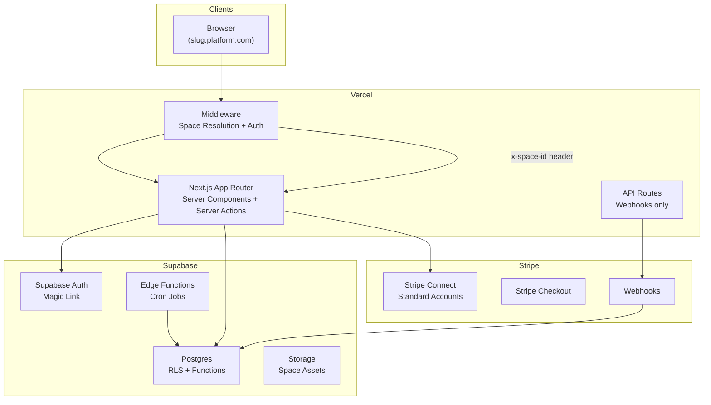
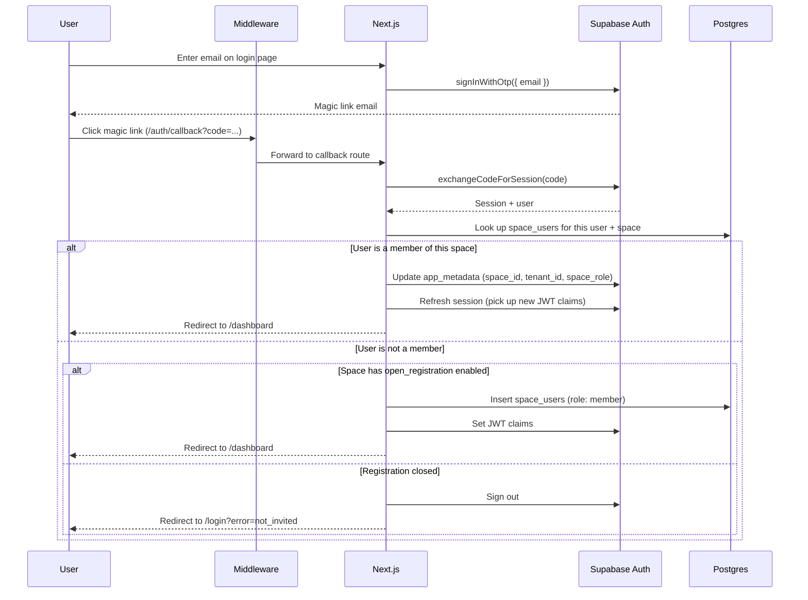
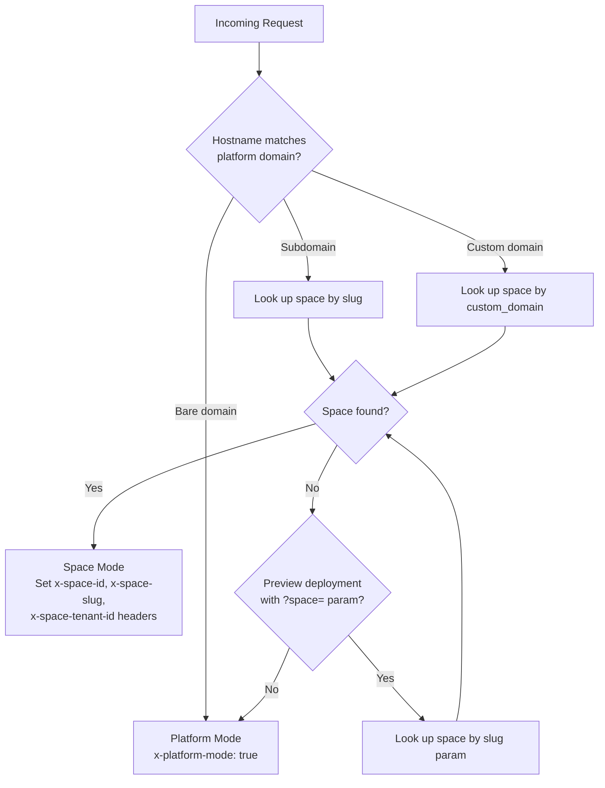
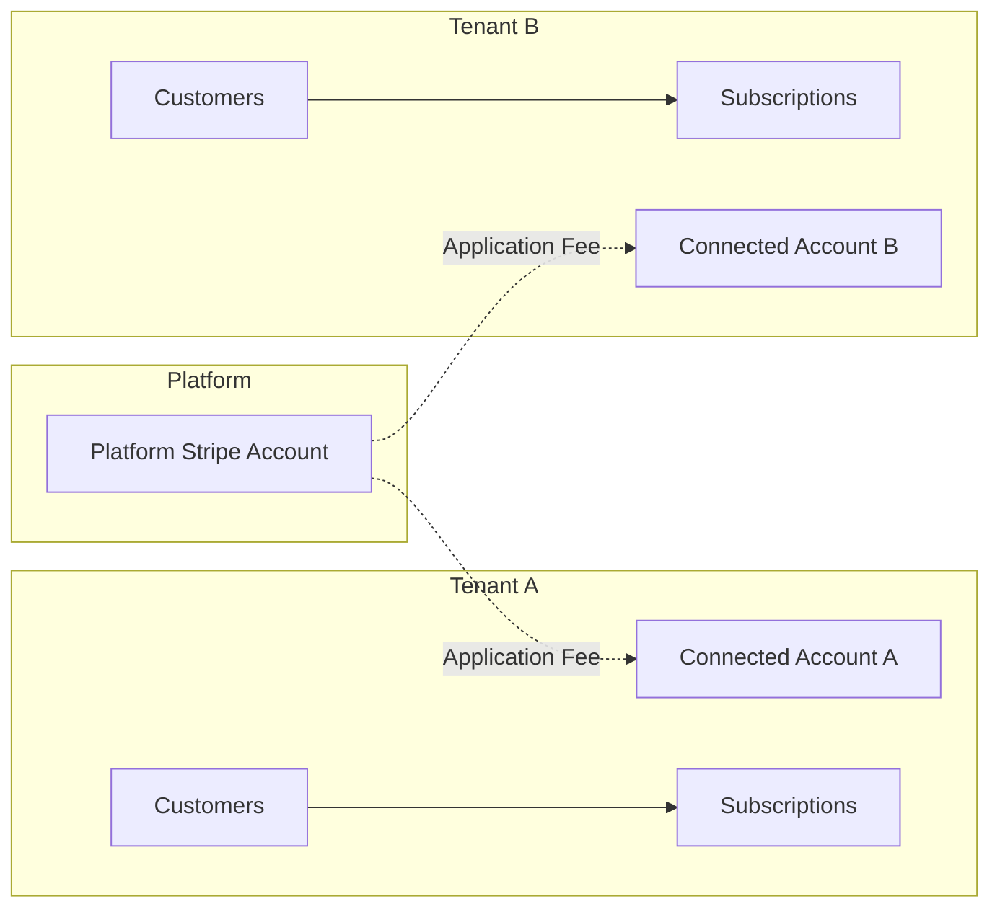
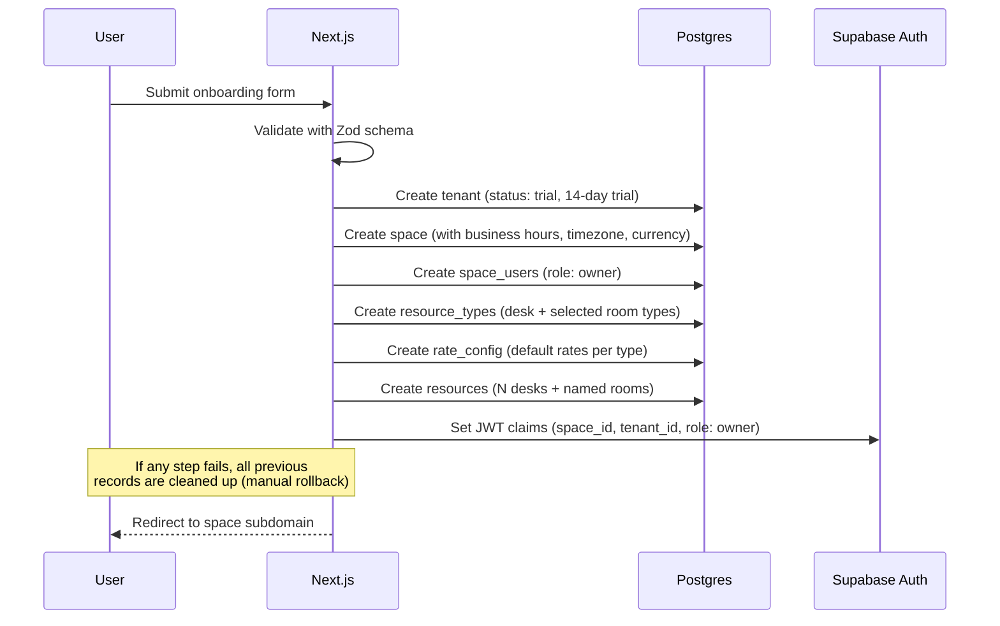

# Architecture

System architecture for the cowork-platform: a white-label, multi-tenant coworking management platform.

---

## High-Level Overview



## Multi-Tenancy Model

The platform uses a **single-database, shared-schema** multi-tenant architecture. Every operational table includes a `space_id` foreign key, and Row Level Security (RLS) policies enforce data isolation at the database level.

### Hierarchy

```
tenant (the business account)
  └── space (the physical location)
        └── all operational data (members, bookings, resources, plans, etc.)
```

- **Tenant**: The billing entity -- a coworking business or company. Holds the Stripe Connect account, platform subscription, and billing details. One tenant can have multiple spaces (currently limited to one in V1, but the schema supports many).
- **Space**: A physical coworking location. Resolved from subdomain or custom domain. All user-facing data is scoped to a space.
- **User**: A person identified via Supabase Auth. One user (in `shared_profiles`) can be a member at multiple spaces across different tenants. Each space membership is a separate `members` record with its own plan, billing, and credits.

### Platform-Level Tables (no space_id)

| Table | Purpose |
|-------|---------|
| `tenants` | Business accounts with Stripe Connect and platform billing |
| `spaces` | Physical locations with branding, hours, features, domain config |
| `shared_profiles` | Universal user identity (auto-created on signup) |
| `space_users` | Maps users to spaces with roles (member, admin, owner) |
| `platform_admins` | Superadmin access (separate from space roles) |

### Space-Scoped Tables

Every table below has `space_id` and is protected by RLS:

| Table | Purpose |
|-------|---------|
| `resource_types` | Space-defined resource categories (desk, meeting room, etc.) |
| `rate_config` | Hourly rates per resource type |
| `plans` | Membership tiers with pricing and access levels |
| `plan_credit_config` | Monthly credit allowances per plan per resource type |
| `resources` | Physical desks, rooms, booths |
| `members` | Active memberships with Stripe customer/subscription IDs |
| `bookings` | Reservations with overlap prevention via EXCLUDE constraint |
| `recurring_rules` | Patterns for repeating bookings |
| `passes` | Day/week passes with auto-assigned desks |
| `credit_grants` | Time credits (minutes) with source tracking and expiry |
| `booking_credit_deductions` | Links bookings to the credit grants that funded them |
| `products` | Store catalogue (subscriptions, passes, hour bundles, etc.) |
| `leads` | Sales pipeline for prospective members |
| `payment_events` | Stripe webhook audit trail |
| `monthly_stats` / `daily_stats` | Aggregated operational metrics |
| `space_closures` | Holiday/maintenance closures |
| `member_notes` | Append-only admin notes per member |
| `notifications_log` | Email/notification audit trail |
| `waitlist` | Waitlist for full time slots |
| `notification_preferences` | Per-member notification settings |

For the complete schema with column definitions, constraints, and indexes, see [`packages/db/docs/MT-SCHEMA-SPEC.md`](/packages/db/docs/MT-SCHEMA-SPEC.md).

---

## Authentication Flow

Authentication uses **magic links only** via Supabase Auth. There are no passwords.



### JWT Custom Claims

After authentication, the server sets custom claims in the user's `app_metadata`:

```json
{
  "space_id": "uuid",
  "tenant_id": "uuid",
  "space_role": "member | admin | owner"
}
```

These claims are used by RLS policies to scope all database queries to the correct space. Claims are set server-side only (during auth callback or space switching) and cannot be modified by the client.

### Space Switching

When a user navigates to a different space's subdomain, the middleware detects a mismatch between the JWT's `space_id` and the resolved space. It redirects through `/auth/set-space`, which verifies membership and updates the JWT claims for the new space.

---

## Space Resolution

The middleware resolves the current space on every request using the hostname:



Resolution is cached in-memory for 60 seconds per hostname to avoid repeated database lookups in the middleware hot path.

### Two Modes

1. **Space Mode** (`slug.platform.com` or custom domain): The user sees the space-branded UI. All data is scoped to that space. The middleware injects `x-space-id` and related headers for downstream use by layouts and pages.

2. **Platform Mode** (bare `platform.com`): The user sees the platform-level UI for onboarding new spaces or selecting which space to enter.

### Preview Deployments

On Vercel preview deployments (where subdomains are not available), the `?space=slug` query parameter serves as a fallback for space resolution. The middleware preserves this parameter across redirects.

---

## Data Flow

### Server Components (Read Path)

Server Components read data directly from Supabase using the authenticated server client. The Supabase client inherits the user's JWT (with space claims), so RLS automatically filters results to the correct space.

```
Server Component
  → createClient() (server-side, cookie-based auth)
  → supabase.from("table").select(...)
  → RLS filters by space_id from JWT
  → Render HTML
```

### Server Actions (Write Path)

All mutations go through Server Actions. No Client Components write to the database directly.

```
Client Component (form submit / button click)
  → Server Action (marked with "use server")
  → Validate input with Zod
  → Read x-space-id from headers (or user's app_metadata)
  → supabase.from("table").insert/update/delete(...)
  → revalidatePath() to refresh the page
```

### Webhook Path (External Events)

Stripe webhooks are the only API route used for data mutations:

```
Stripe
  → POST /api/webhooks/stripe
  → Verify signature (Connect secret, then platform secret)
  → Resolve tenant/space from event.account
  → Log to payment_events (idempotency check)
  → Route to handler based on event type
  → Update database via admin client (bypasses RLS)
```

---

## Payments Architecture

The platform uses **Stripe Connect with Standard accounts**. Each tenant has their own Stripe account where customers and payments live. The platform collects an application fee on each transaction.



### Payment Flows

**Subscription checkout** (member signs up for a plan):
1. Server Action creates Stripe Customer on connected account (if needed)
2. Server Action ensures Stripe Product + Price exist for the plan
3. Server Action creates Checkout Session with `application_fee_percent`
4. User completes payment on Stripe-hosted checkout
5. `checkout.session.completed` webhook creates/activates member record
6. `invoice.paid` webhook grants monthly credits

**One-time purchase** (pass, hour bundle, addon):
1. Server Action ensures Product + Price on connected account
2. Server Action creates Checkout Session with `application_fee_amount`
3. Webhook handler routes by `product_category` metadata:
   - `pass`: Activates pass + auto-assigns desk
   - `hour_bundle`: Grants credits based on product config
   - `deposit` / `event`: Logged only

**Subscription lifecycle** (handled via webhooks):
- `invoice.paid`: Reactivates past-due members, expires old credits, grants new credits
- `invoice.payment_failed`: Sets member status to `past_due`
- `customer.subscription.updated`: Syncs plan changes and cancellation status
- `customer.subscription.deleted`: Churns member, expires all renewable credits
- `account.updated`: Syncs Connect onboarding status to tenant record

### Platform Fee

The platform collects a per-tenant application fee. Each tenant's fee is determined by their platform plan (free=5%, pro=3%, enterprise=1%) with an optional per-tenant override stored in `tenants.platform_fee_percent`. Platform admins can adjust the fee from the admin app.

- **Subscriptions**: Percentage-based via `application_fee_percent`
- **One-time payments**: Fixed amount via `application_fee_amount` calculated from the total

---

## Security Model

### Row Level Security (RLS)

Every table has RLS enabled. Five policy patterns are used consistently:

| Pattern | Use Case | Logic |
|---------|----------|-------|
| Users read own | Members viewing their data | `user_id = auth.uid() AND space_id = JWT.space_id` |
| Space admins read all | Admin dashboards | `is_space_admin(auth.uid(), JWT.space_id) AND space_id = JWT.space_id` |
| Space admins full CRUD | Admin management | Same as above, for all operations |
| Public read | Products, resources | `space_id = JWT.space_id` (any authenticated user in the space) |
| Platform admins full | Superadmin dashboard | `is_platform_admin(auth.uid())` |

### Security Functions

- `verify_space_access(p_space_id)` -- Called at the top of every `SECURITY DEFINER` function to prevent cross-tenant access
- `is_space_admin(p_user_id, p_space_id)` -- Checks the `space_users` table for admin/owner role
- `is_platform_admin(p_user_id)` -- Checks the `platform_admins` table

### Critical Security Rules

1. Every `SECURITY DEFINER` function filters by `space_id` in all queries
2. Space admins can only see profiles of users who are members of their space
3. Stripe webhooks verify `event.account` matches the space's connected account
4. Platform admin is a separate table -- space admin privileges never escalate to platform admin
5. JWT claims are set server-side only, never by client-callable RPCs
6. Suspended tenants retain data but lose access (enforced in middleware)

### Role Hierarchy

```
platform_admin (superadmin -- separate table, separate policies)

owner   → Full space management, billing, can manage other admins
admin   → Member/resource/booking/lead management within the space
member  → Book resources, view own data, manage own profile
```

Admin role is checked via the `space_users` table, never via JWT claims alone (claims are a performance optimization, not the source of truth).

---

## Route Groups

The app uses Next.js route groups to separate concerns:

| Group | Path Pattern | Purpose | Auth |
|-------|-------------|---------|------|
| `(app)` | `/dashboard`, `/book/*`, `/admin/*` | Authenticated space features | Required + space context |
| `(auth)` | `/login`, `/auth/callback`, `/auth/set-space` | Authentication flows | Public (except set-space) |
| `(platform)` | `/onboard`, `/spaces` | Platform-level operations | Required (no space context) |

### Admin Routes

All routes under `(app)/admin/` are protected by an additional layout-level check that verifies the user has `admin` or `owner` role. Unauthorized users are redirected to `/dashboard`.

Admin sections:
- `/admin/bookings` -- Booking management with daily view and walk-in support
- `/admin/members` -- Member directory
- `/admin/leads` -- Sales pipeline
- `/admin/passes` -- Pass management
- `/admin/plans` -- Plan configuration with credit settings
- `/admin/products` -- Store catalogue management
- `/admin/resources` -- Resource and resource type management
- `/admin/settings` -- Space branding, operations, features, fiscal config, Stripe Connect

---

## Onboarding Flow

When a new tenant signs up:



After onboarding, the admin dashboard shows a setup checklist: configure plans, add resources, connect Stripe, invite first member.

---

## Key Design Decisions

### Server Components by default
All pages are Server Components unless they require client-side interactivity. This minimizes client-side JavaScript and enables direct database access without API routes.

### Server Actions for mutations
All write operations go through Server Actions (not API routes). API routes are reserved for external webhooks only. This keeps mutations colocated with the UI that triggers them.

### Space-scoped everything
Every piece of operational data has a `space_id`. Combined with RLS and JWT claims, this provides strong data isolation without separate databases per tenant.

### Configurable business logic
Plans, resource types, rates, products, business hours, and feature flags are all tenant-configurable. No business logic is hardcoded that should vary between spaces.

### Credit system
Credits are tracked in minutes per resource type, with FIFO expiry (subscription credits expire monthly, purchased credits do not). The `booking_credit_deductions` junction table enables precise refunds.

### Stripe Connect Standard accounts
Standard (not Express or Custom) Connect accounts give each tenant their own full Stripe dashboard. The platform only needs to create checkout sessions and process webhooks.

### Database functions for critical operations
Booking creation, credit deduction, and pass activation are implemented as Postgres functions (`SECURITY DEFINER`) to ensure atomicity and enforce business rules regardless of the calling context.
